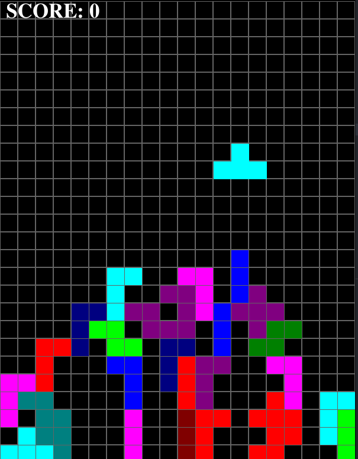

# Pygame 
All games were created during this Udemy course [link](https://www.udemy.com/course/exploring-game-mechanics-with-python-and-pygame/).
## :boom: Breaking Bricks
The player should destroy all bricks to win the game.

## :video_game: Tetris

## Contact
If you have any questions, comments, or suggestions, please feel free to contact me at oleksandrr1996@protonmail.com
